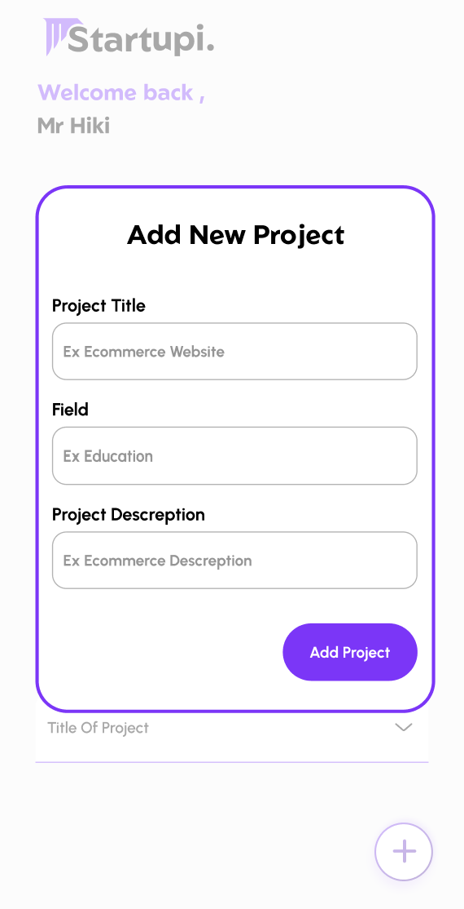
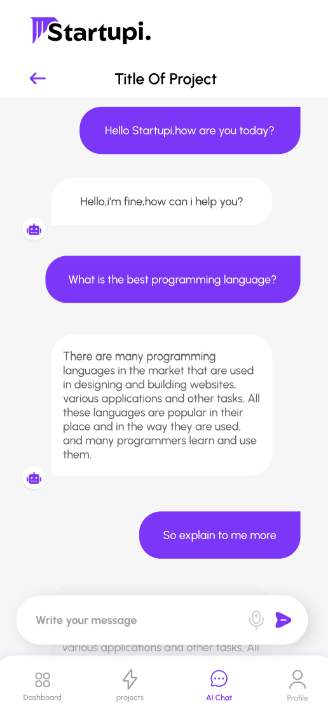

# devfest_batna_2024
# Expert Agent Chat Bot App

Welcome to the **Startupi**! This Flutter-based application provides users with an interactive chat experience powered by a backend API developed using Express.js. The app features secure authentication, ensuring a personalized and secure user experience.

## Features

- **Authentication**: Secure login and signup functionality.
- **Expert Agent bot Integration**: Communicates with an Express.js backend to provide expert-level responses to user queries.
- **Responsive UI**: Designed to work seamlessly across Android and iOS devices.
- **Real-Time Communication**: Smooth and efficient interaction with the backend API for real-time responses.

## Screenshots







## Installation

### Prerequisites

- Flutter SDK: [Installation Guide](https://flutter.dev/docs/get-started/install)
- Node.js and npm: [Installation Guide](https://nodejs.org/en/download/)

### Backend Setup

1. Clone the backend repository:
   ```bash
   git clone <backend-repo-url>
   cd <backend-repo-folder>
   ```

2. Install dependencies:
   ```bash
   npm install
   ```

3. Start the backend server:
   ```bash
   npm start
   ```

4. Ensure the backend server is running on the correct port (default: `http://localhost:3000`).

### Frontend Setup

1. Clone this repository:
   ```bash
   git clone <frontend-repo-url>
   cd <frontend-repo-folder>
   ```

2. Install dependencies:
   ```bash
   flutter pub get
   ```

3. Run the app:
   ```bash
   flutter run
   ```

## API Communication

The app communicates with the Express.js backend via REST APIs for:

- **Authentication**:
  - `POST /api/auth/login`: User login
  - `POST /api/auth/signup`: User registration

## Directory Structure

```
lib/
|-- core/
|-- features/
    |-- authentication/
    |   |-- data/
    |   |-- domain/
    |   |-- presentation/
    |-- chat/
        |-- data/
        |-- domain/
        |-- presentation/
|-- shared
        |-- utils
        |--widgets
|
```

## Technologies Used

- **Frontend**: Flutter (Dart)
- **Backend**: Express.js (Node.js) & Fast API
- **State Management**: BLoC
- **Authentication**: JWT

## Future Enhancements

- Add multi-language support.
- Integrate advanced natural language processing.
- Enhance UI/UX for a more engaging experience.
- Introduce push notifications for new messages.

## Contributing

We welcome contributions to improve this app! Please follow these steps:

1. Fork the repository.
2. Create a feature branch: `git checkout -b feature-name`.
3. Commit your changes: `git commit -m "Add feature-name"`.
4. Push to the branch: `git push origin feature-name`.
5. Open a pull request.

## License

This project is licensed under the MIT License. See the [LICENSE](LICENSE) file for details.

## Contact

---

Thank you for using the Expert Agent Chat Bot App!


